# Windows Firewall Port Access Control – Test Lab

Configured and tested Windows Firewall inbound rules to **block** and **allow**
a specific TCP port (80/HTTP), and validated the effect of each rule using
live network traffic between two machines on a LAN.

---

## Overview

This project demonstrates how a host-based firewall can be used to control
network access to a service, and how to verify that control is actually
working — not just configured. A simple HTTP service was hosted on one
machine (the **target**), and a second machine (the **client**) attempted to
connect to it on port 80 before and after each firewall rule change.

## Objective

- Configure inbound firewall rules using **Windows Defender Firewall with
  Advanced Security** (`wf.msc`).
- Block inbound TCP traffic on port 80 and confirm the block from a remote
  client machine.
- Reverse the change by allowing the traffic, and confirm the service becomes
  reachable again.
- Document the full process with a clear before/during/after evidence trail
  for each test.

## Lab Environment

| Role | Device | IP Address | Purpose |
|---|---|---|---|
| **Target** | Lenovo laptop | `192.168.1.27` | Hosts an HTTP service on port 80 and enforces the firewall rules being tested |
| **Client** | HP laptop | `192.168.1.6` | Sends TCP connection attempts to the target on port 80 to verify whether traffic is allowed or blocked |

Both machines were connected to the same local network (LAN).

## 🛠️ Tools & Technologies

- **Windows Defender Firewall with Advanced Security** (`wf.msc`) — rule creation and management
- **Python `http.server`** — lightweight HTTP service used to simulate a real, listening web server on port 80
- **PowerShell `Test-NetConnection`** — TCP connectivity testing from the client machine
- **`ipconfig`** — confirming the target machine's LAN IP address

---

## 🔧 Methodology — Creating a Firewall Rule

Before any rule existed, the firewall's default state was confirmed:

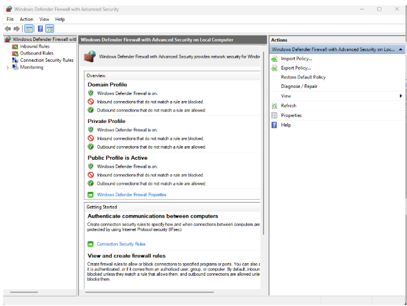

*Windows Defender Firewall with Advanced Security — default state before any custom rule was created.*

The following steps were used to create each inbound rule (only the **Action**
step differs between the Block rule and the Allow rule):

**1. Open the console.**
Press `Start`, type `wf.msc`, and press Enter (alternatively: *Control Panel →
System and Security → Windows Defender Firewall → Advanced settings*). This
console provides granular control over Inbound and Outbound rules, unlike the
basic Firewall interface.

**2. Select the rule direction.**
From the left-hand pane, **Inbound Rules** was selected, since the goal was to
control access *to* the HTTP service running on the target machine (as
opposed to **Outbound Rules**, which control traffic leaving the machine).
`New Rule…` was then selected from the Actions pane.

**3. Choose the rule type and port.**

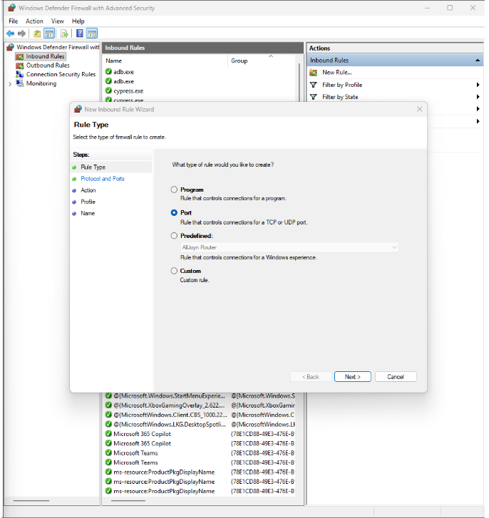

*Rule Type — Port was selected, to target a specific TCP/UDP port rather than a specific application.*

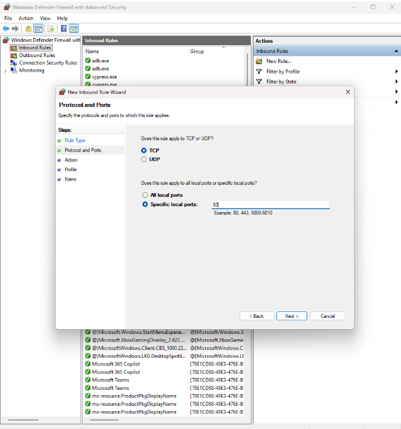

*Protocol and Ports — TCP, specific local port 80 (HTTP).*

**4. Specify the action.**
Three options are available: *Allow the connection*, *Allow the connection if
it is secure* (IPsec-authenticated only), and *Block the connection*. This is
the variable being tested.

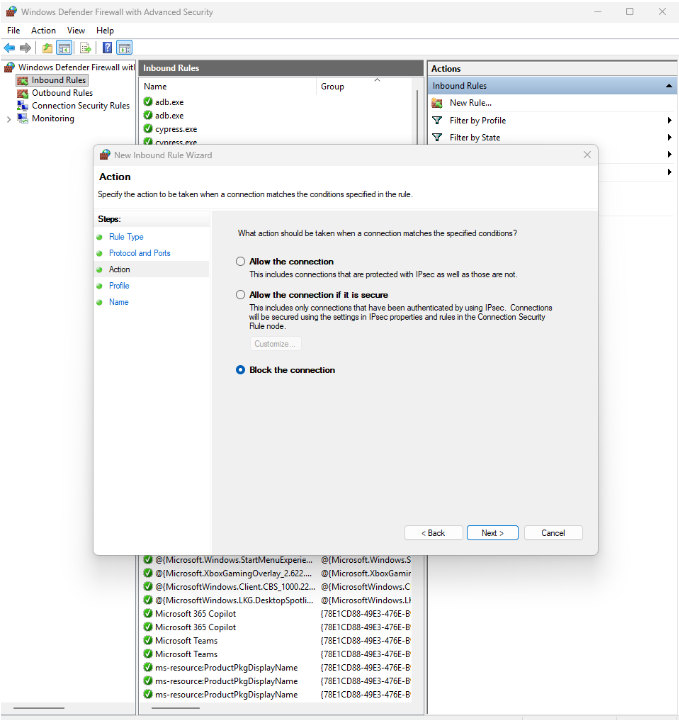

*Action — Block the connection, for the first test.*

**5. Select the applicable network profiles.**

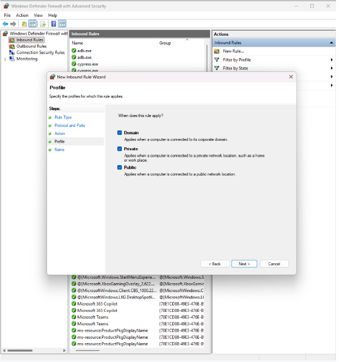

*All three profiles (Domain, Private, Public) were selected so the rule is enforced regardless of how the LAN connection is classified.*

**6. Name and describe the rule.**

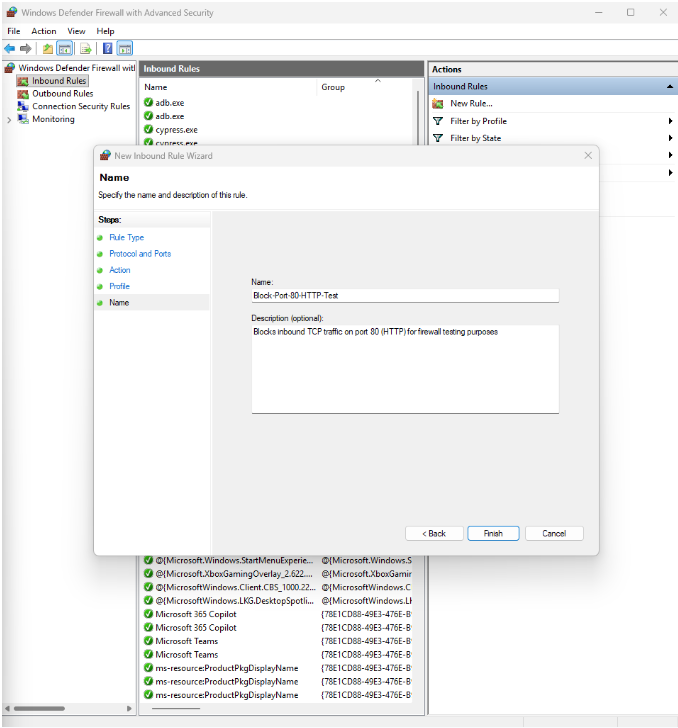

*A clear, descriptive name and description were given to the rule, making it easy to identify later.*

The rule then appears active in the Inbound Rules list:

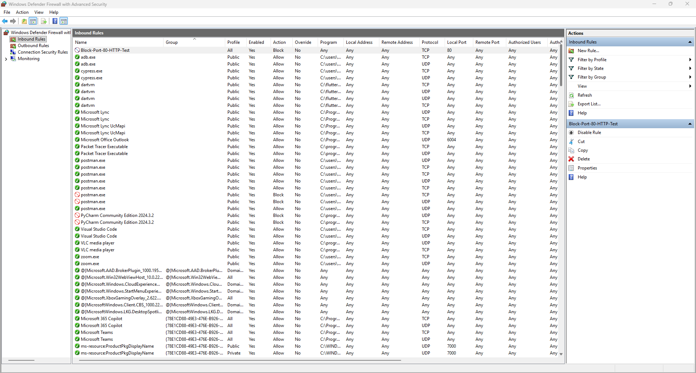

*`Block-Port-80-HTTP-Test` shown as Enabled, Action: Block, TCP, Local Port 80.*

---

## Test Setup

The target machine's LAN IP address was confirmed with `ipconfig`:

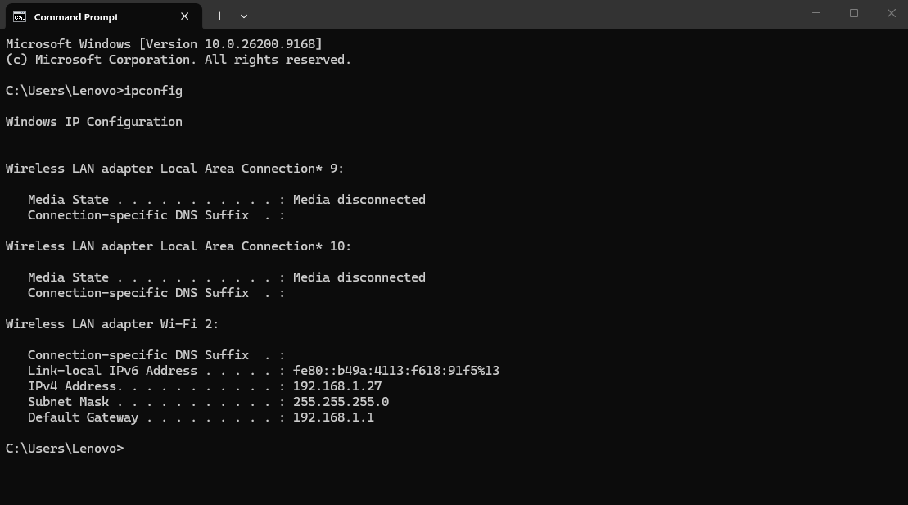

*Target machine (Lenovo) — IPv4 address 192.168.1.27.*

A lightweight HTTP server was then started on the target machine to simulate a
real, listening service on port 80:

```
python -m http.server 80
```

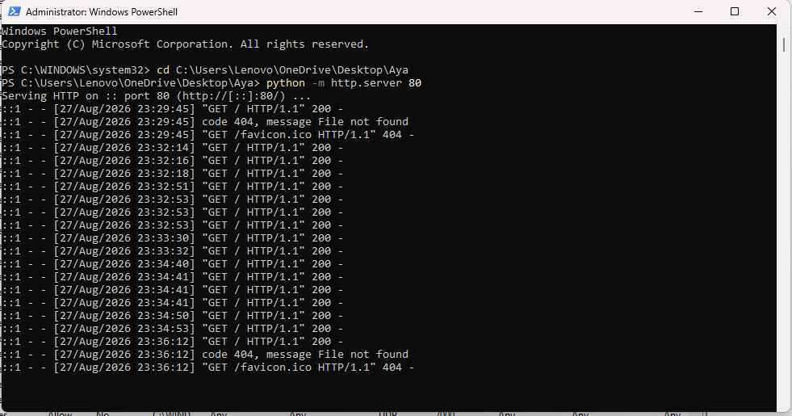

*Python's built-in HTTP server listening on port 80, logging incoming requests.*

From the client machine, connectivity was tested with:

```
Test-NetConnection -ComputerName 192.168.1.27 -Port 80
```

---

## Test 1 — Blocking Port 80

With the `Block-Port-80-HTTP-Test` rule active, the client attempted to
connect to the target on port 80.

| Stage | Screenshot |
|---|---|
| **Before** — command typed, not yet executed |  |
| **During** — attempting the TCP connection |  |
| **After** — result | 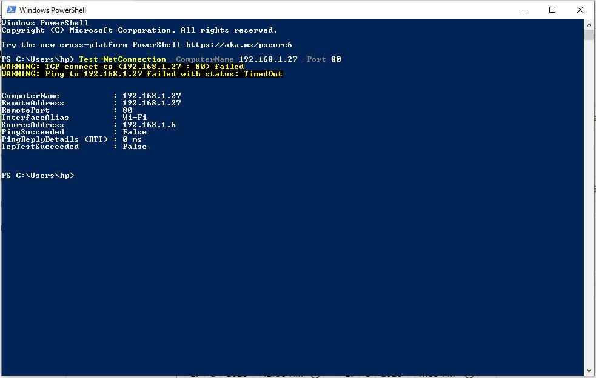 |

**Result:** `TcpTestSucceeded : False`, with a `TCP connect ... failed` and
`Ping ... TimedOut` warning — confirming the firewall rule successfully
blocked the connection from reaching the target machine.

---

## Test 2 — Allowing Port 80

A new rule was created to restore access, following the same steps as before
but with the action set to **Allow the connection**:

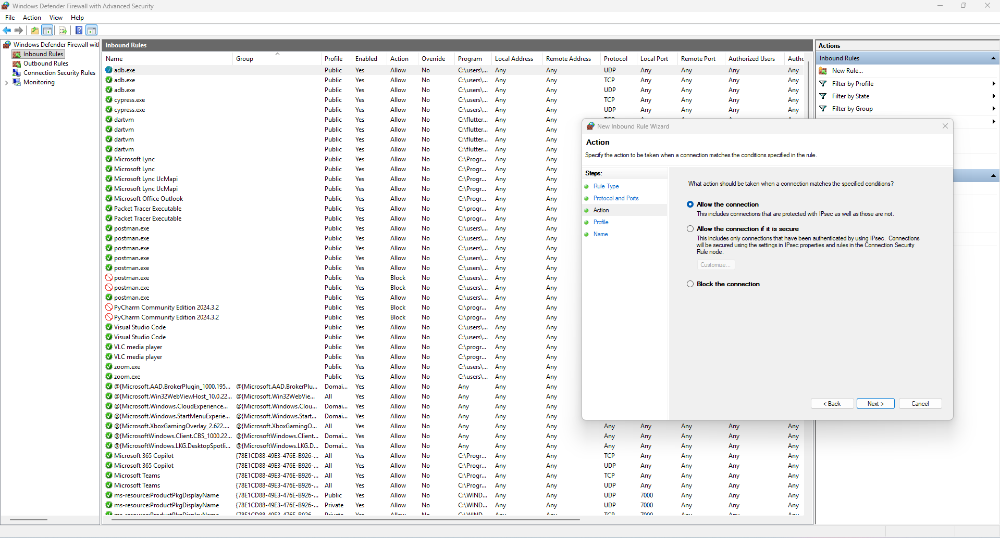

*Action — Allow the connection, for the second test.*

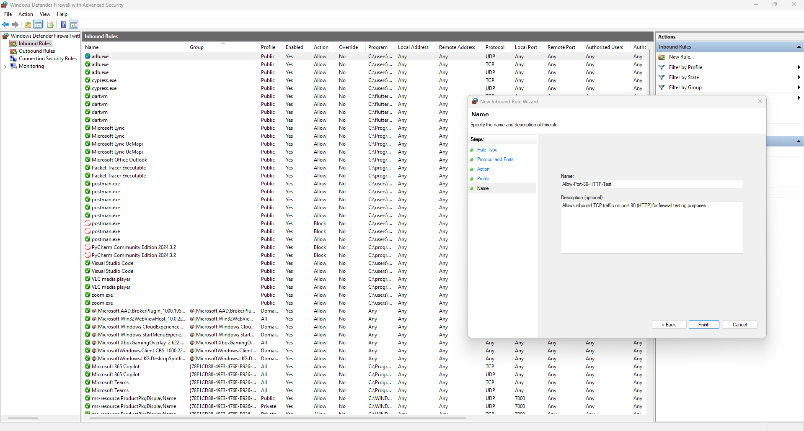

*Name — Allow-Port-80-HTTP-Test, with a description of its purpose.*

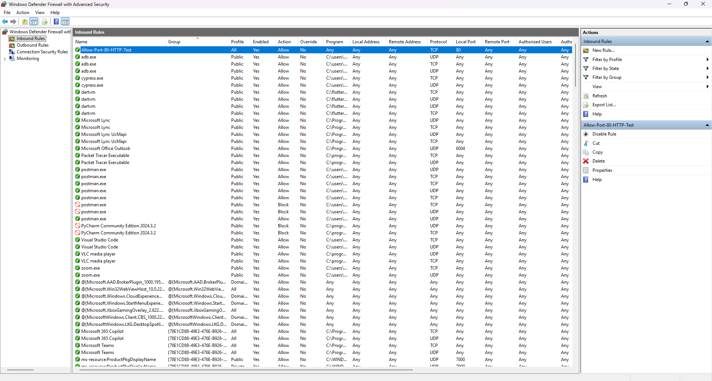

*`Allow-Port-80-HTTP-Test` shown as Enabled, Action: Allow, TCP, Local Port 80.*

Before testing from the remote client, the service was verified locally on
the target machine itself:

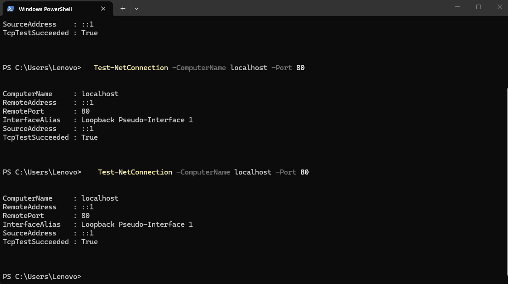

*`Test-NetConnection -ComputerName localhost -Port 80` on the target machine — `TcpTestSucceeded : True`, confirming the HTTP service was listening correctly.*

The same connectivity test was then repeated from the client machine:

| Stage | Screenshot |
|---|---|
| **Before** — command typed, not yet executed | 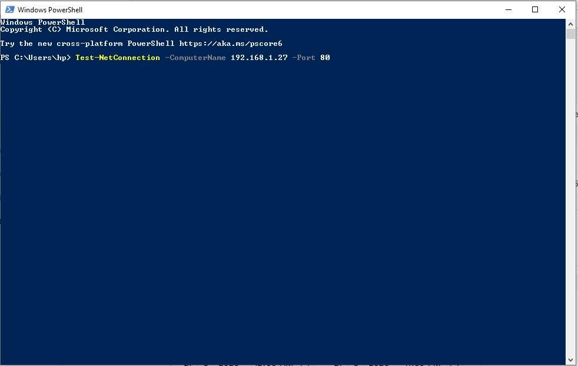 |
| **During** — attempting the TCP connection | 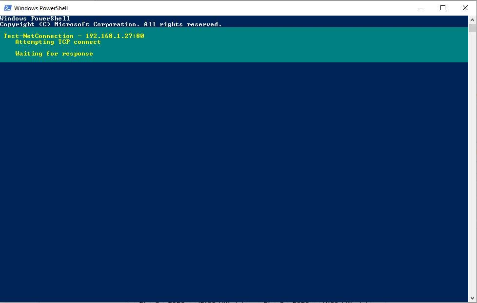 |
| **After** — result | 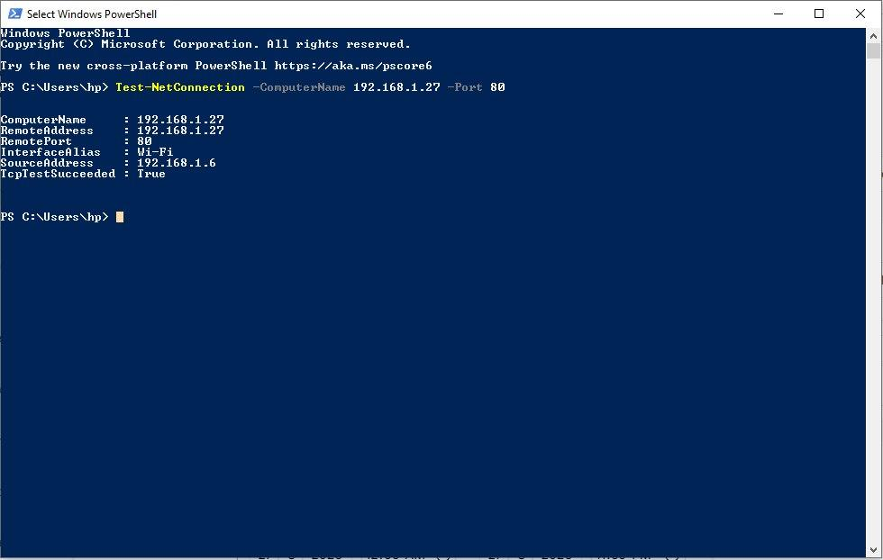 |

**Result:** `TcpTestSucceeded : True` — confirming the connection now
succeeds, once the Allow rule is in place.

---

## Key Skills Demonstrated

- Configuring inbound firewall rules by port, protocol, action, and network profile using Windows Defender Firewall with Advanced Security
- Validating firewall behavior with real network traffic between two machines, rather than relying on configuration alone
- Using PowerShell (`Test-NetConnection`) for TCP-level network diagnostics
- Structuring and documenting a hands-on security test with clear, reproducible before/during/after evidence
